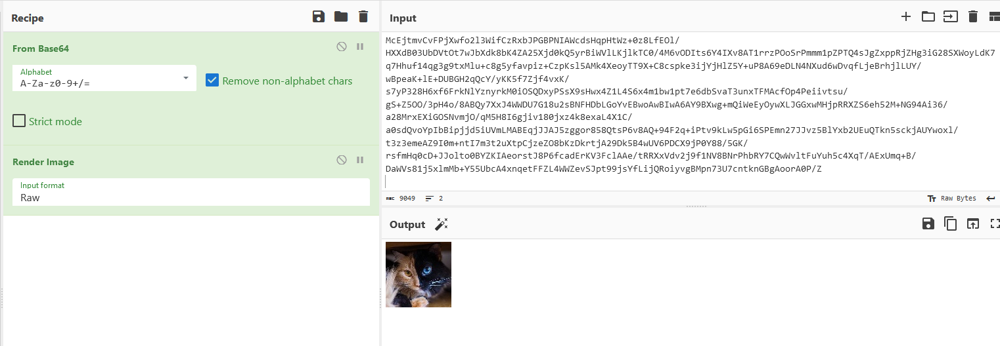
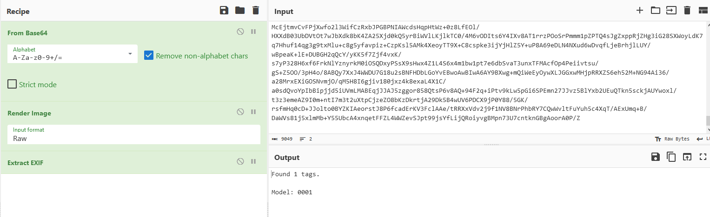
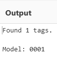
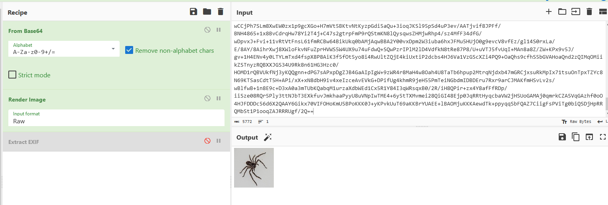
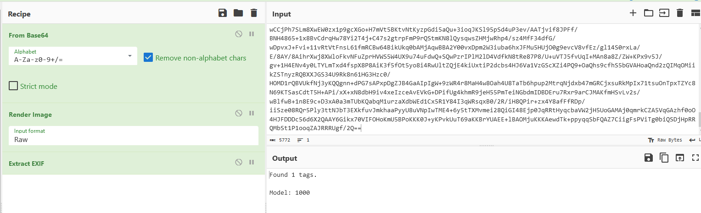

# Useless Animals Sorting
> A bored zookeeper, tired of the monotony of his daily routine, decided to invent a machine to sort the animals arriving at the zoo. Not that it would make his life any easier... he's just bored out of his mind and needs something to pass the time. An amateur engineer in his spare time, he has begun designing the contraption and now turns to you for help. You look just as bored as he is and everyone loves machines right ? So why not lend a hand?
> 
> `challenges.hackday.fr:51259`

Let's try to connect that port using `nc`(netcat).
Here, we got such a message:

>Welcome to the animal guessing game !
You have to guess the animal in 100 images in 100s. 5 errors allowed
Good luck !
> 
> List of correct answers : 'dog', 'horse', 'elephant', 'butterfly', 'chicken', 'cat', 'cow', 'sheep', 'spider', 'squirrel'
> 
> Press Enter to start the game

The next message after sending next line `\n` symbol is base64 :

>Image №1 :
/9j/4QBmRXhpZgAATU0AKgAAAAgAA4dpAAQAAAABAAAAUoglAAQAAAABAAAAWAEQAAIA...
> 
> Animal ?

This base64 is jpeg image:



This image seems to be pretty clear, but there are a lot of unclear images and any OCR model can make a mistake during analyzing 100 images. 

There should be something more. If we deepen into the inner image data, then we'll get such a data:




Here's another image and it also contains that `Model` tag:




Let's collect all animals' model values by getting base64 and its exif data:

```
butterfly - 0000
cat - 0001
chicken - 0010
cow - 0011
dog - 0100
elephant - 0101
horse - 0110
sheep - 0111
spider - 1000
squirrel - 1001
```

The last step just to write a script that will connect, parse the data and send animal name. I did it with python and dictionary to get immediately an animal's name by model value:

```python
from pwn import *
import base64
import PIL.Image
import PIL.ExifTags

animals_list = {
                "0000": "butterfly",
                "0001": "cat",
                "0010": "chicken",
                "0011": "cow",
                "0100": "dog",
                "0101": "elephant",
                "0111": "sheep",
                "1000": "spider",
                "0110": "horse",
                "1001": "squirrel"
                }

def process_image(base64_image):
    try:
        image_data = base64.b64decode(base64_image)
        img = PIL.Image.open(BytesIO(image_data))
        model = img.getexif().get(272)
        return animals_list[model]

    except Exception as e:
        print(f"Error processing image {i}: {e}")
        return animals_list[0]


host = "challenges.hackday.fr"
port = 51259
conn = remote(host, port)

conn.recv()
conn.sendline('')

n = 100
for i in range(n):
    try:
        line = conn.recvline().decode().strip()
        base64_image = conn.recvline().decode()
        conn.recvline()

        result = process_image(base64_image)

        conn.sendline(result.encode())
        print(conn.recvline().decode())

    except EOFError:
        print("Server closed the connection.")
        break

conn.interactive()
conn.close()
```

At the end we get such a flag:

`HACKDAY{c3rtIfIED_zOOlogI$t}`
