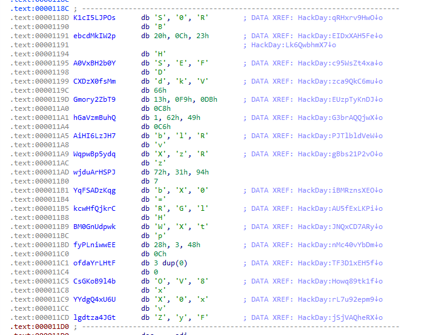

# Just dig 

> Researchers have recently uncovered a mysterious ancient artifact beneath the Cogswell Halls. Its purpose remains unknown, but its potential seems invaluable. Who knows? The secrets it holds could revolutionize modern knowledge. They need an expert eye—yours! Let's dig in !
> 
> sha256: 966a1f6b87a7c29df32838da5afeead32c5141603faba59b4373c98bcd67b5d9

Firstly, let's determine what the file type is. As we can see it is a portable executable binary:


The next step is decompiling the file (use any decompiler like `IDA`, `Ghidra`, etc.):


The `main` functions executes only one function `HackDay`:

```сpp
char *HackDay()
{
  char *result; // eax

  result = 0;
c95WsZt4xa:
  if ( ++i != 1 )
  {
    if ( ++i != 1 )
      goto gBbs21P2vO;
    goto PJTlbldVeW;
  }
  i = 2;
JNQxCD7ARy:
  result = BM0GnUdpwk;
  if ( ++i == 3 )
    goto rL7u92epm9;
  while ( 1 )
  {
    if ( ++i != 7 )
      return result;
Howq89tk1f:
    if ( ++i != 8 )
      goto JNQxCD7ARy;
PJTlbldVeW:
    result = AiHI6LzJH7;
    if ( ++i == 9 )
      break;
    result = Gmory2ZbT9;
    if ( ++i == 1 )
      break;
AU5fExLKPi:
    if ( ++i != 6 )
      goto c95WsZt4xa;
  }
gBbs21P2vO:
  if ( ++i == 10 )
    goto iBMRznsXEO;
  if ( ++i == 1 )
    goto AU5fExLKPi;
rL7u92epm9:
  result = YYdgQ4xU6U;
  if ( ++i == 4 )
  {
    i = 5;
    goto AU5fExLKPi;
  }
iBMRznsXEO:
  if ( ++i != 11 )
    goto Howq89tk1f;
  result = ofdaYrLHtF;
  i = 12;
  return result;
}
```

We see that it uses some data to assign to result and some chars cannot be converted to readable format
:



Let's try to debug the function step by step:


Some data is pushed to `EBX` register:


The next value:


Oh, you see, it's the part of the flag:


`EAX` register is changed:


and so on... we got the flag `HACKDAY{i_LovE_DiGg!n9_1nTo_4sm}`


