# Internal Blog

> You’ve received an anonymous tip from the Airship Mail Delivery Company claiming that a seemingly legitimate website is actually a front for trading stolen submarine mechanical parts. Yeah, that’s oddly specific...
> 
> The localhost port is 3000. Take a closer look and see if you can uncover anything suspicious. The flag to find is the bot's cookie.
> 
> `challenges.hackday.fr:61394`

Upon opening the website, we see the following webpage with articles.

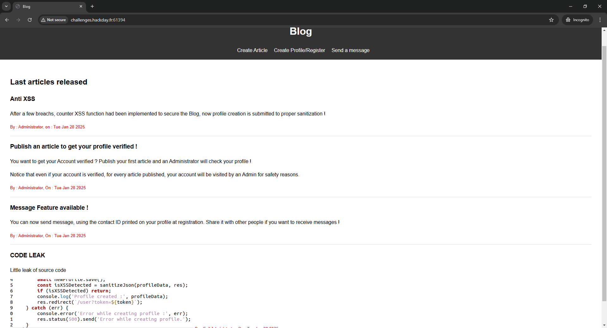

We should notice the code leak here that could help us later.

```js
      await NewProfile.save();
      const isXSSDetected = sanitizeJson(profileData, res);
      if (isXSSDetected) return;
      console.log('Profile created :', profileData);
      res.redirect(`/user?token=${token}`);
    } catch (err) {
      console.error('Error while creating profile :', err);
      res.status(500).send('Error while creating profile.');
    }
});
```

We can create a profile, create an article as a user, and send a message to another user.

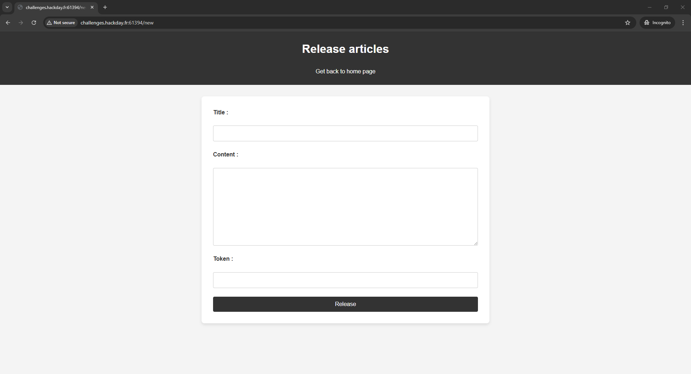
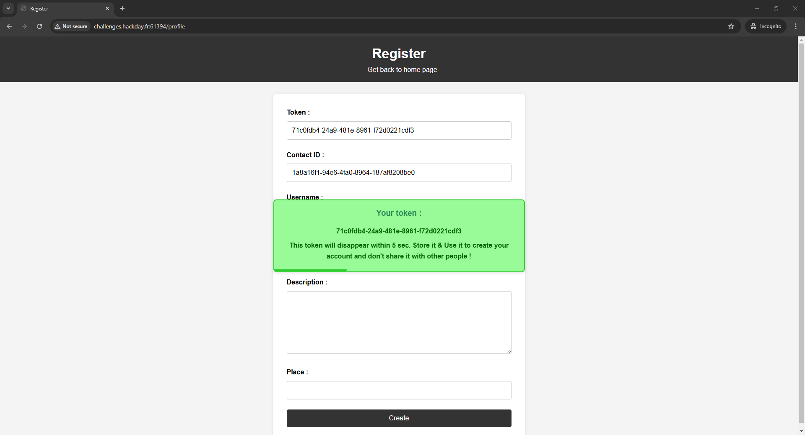
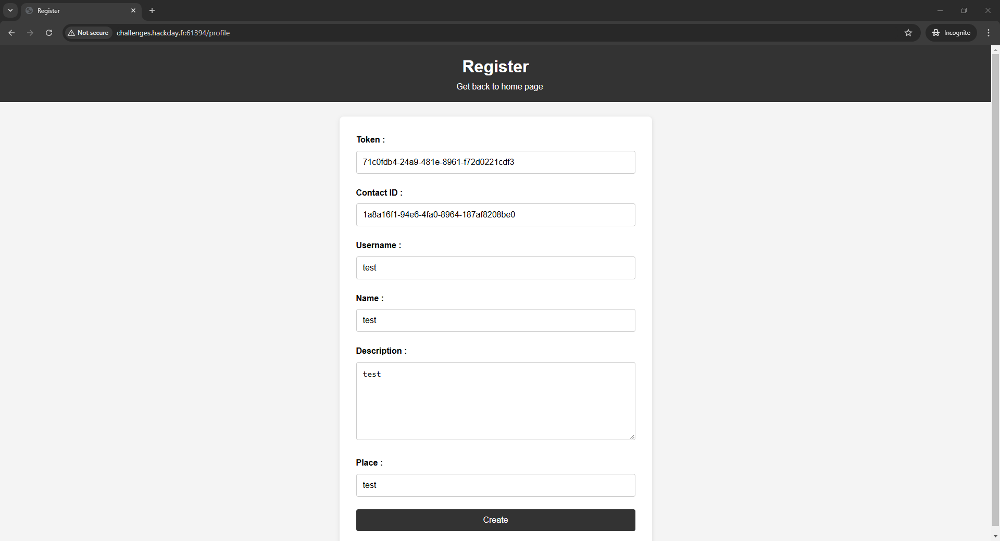
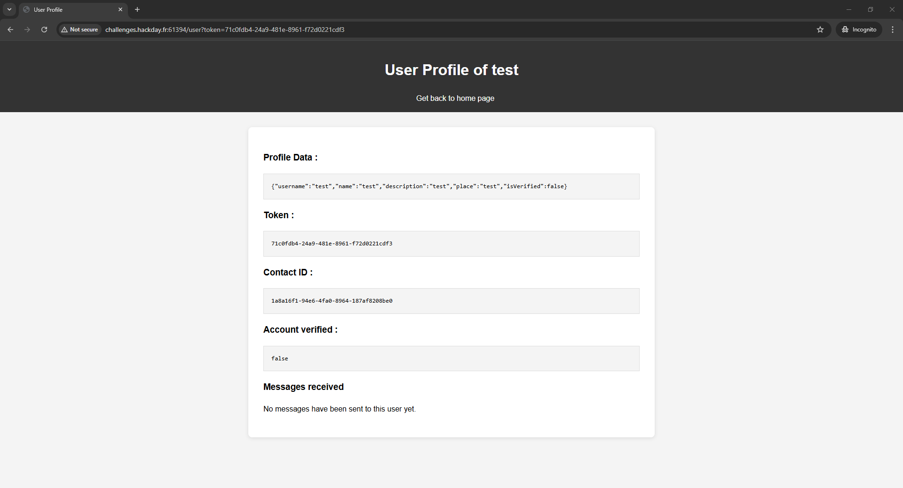
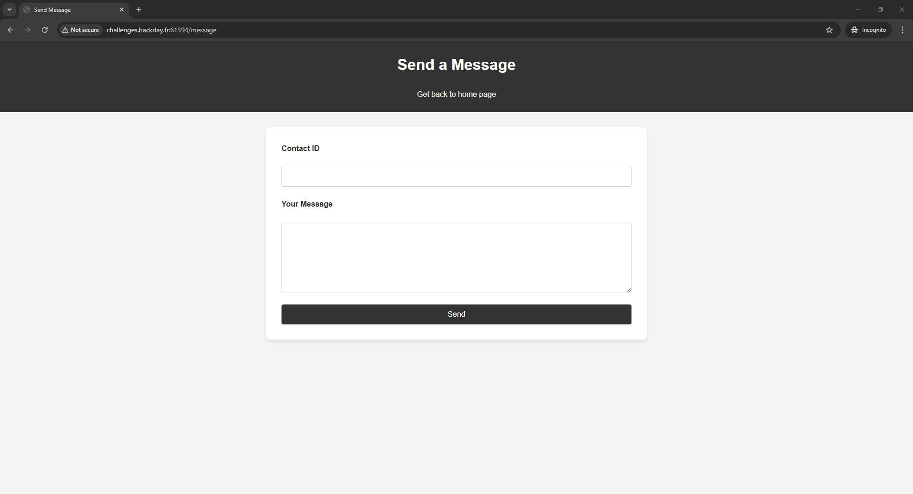

If we try to send a message, we will be redirected to `http://challenges.hackday.fr:61394/sendmessage`. The message will then appear in user's profile.

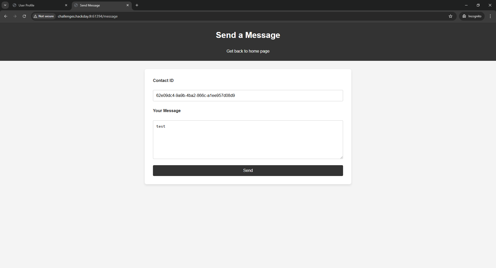
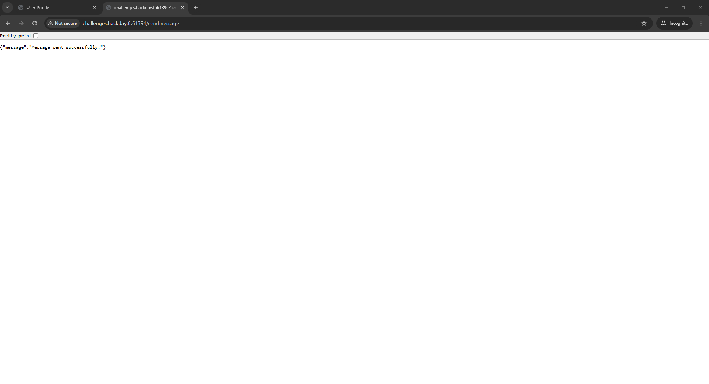
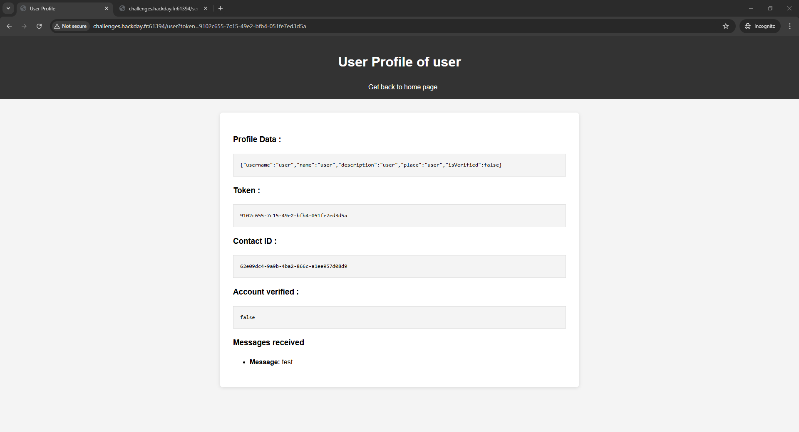

So, what do we know?

- From the description we know, that our goal is to receive bot's cookies, and the internal server runs on port 3000.
- From the homepage, we know that Administrator (bot) will check the user's profile when they post an article to verify it.
- Additionally, the code leak tells us that the website has **XSS** protection, but `await NewProfile.save();` saves the account before sanitizing the inputs.
- We could send a POST request with "contact" and "message" fields to `http://challenges.hackday.fr:61394/sendmessage` and it will appear in the user's profile.

Now we should combine our knowledge to create a plan of action.
1. We should create a profile with **reflected XSS** in the inputs.
2. This **reflected XSS** should send a POST request to the `/sendmessage` with our profile's contact ID as the "contact" field and the bot's cookies as the "message" field.
3. We should post a new article and wait for Evil Administator to check our profile.
4. Finally, we should check our profile to see if we received the message.

Let's start our work.

Firstly, we will create a new profile with the following script.

```html
&message='+document.cookie
  });
">
```

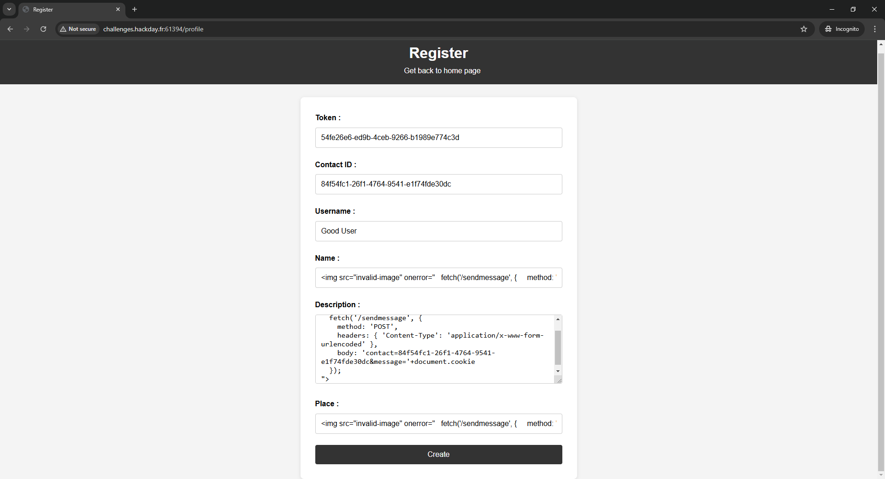

The server has detected XSS, but that's okay for us because the profile was created.

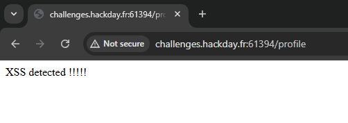

Next, we will create a new article using our token.

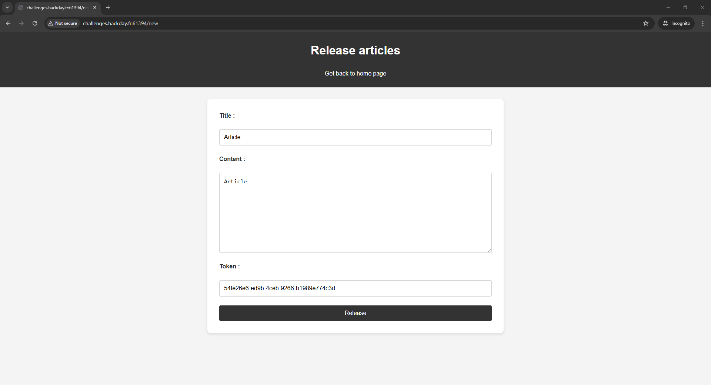
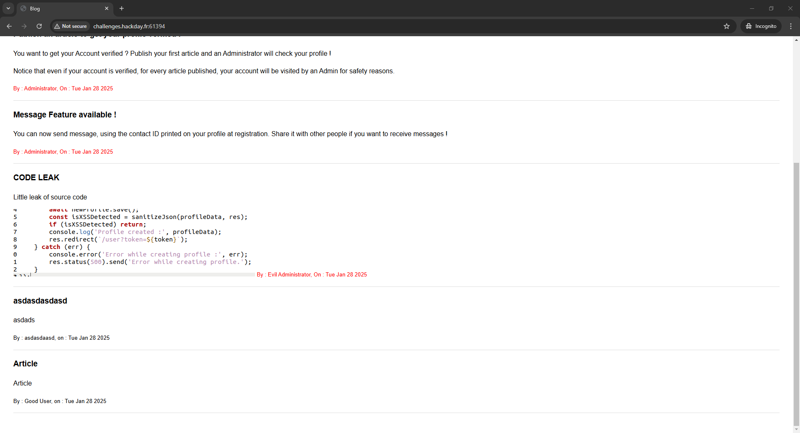

Now we should wait a few seconds and open our profile by navigating to `http://challenges.hackday.fr:61394/user?token=<OUR_TOKEN>`

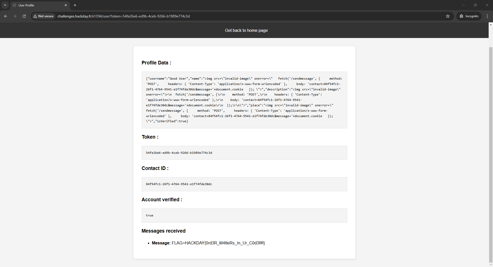

`HACKDAY{0rd3R_M4tteRs_In_Ur_C0d3!!!!}`
