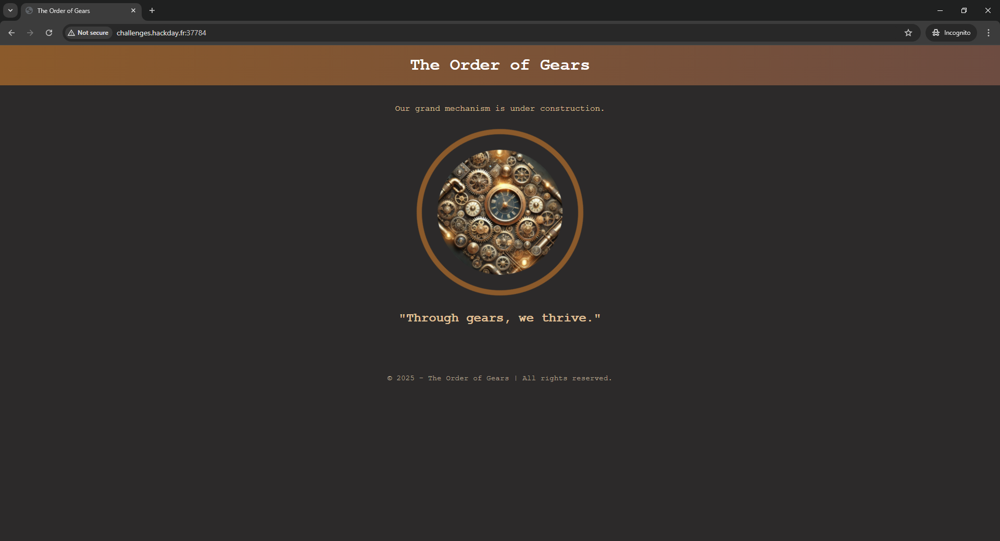
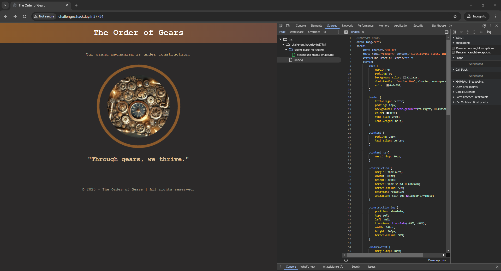
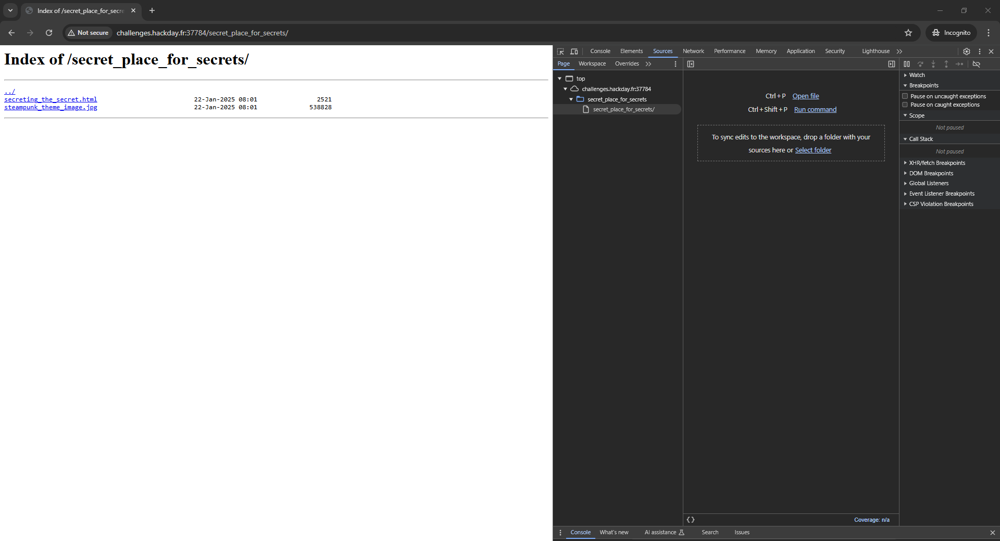
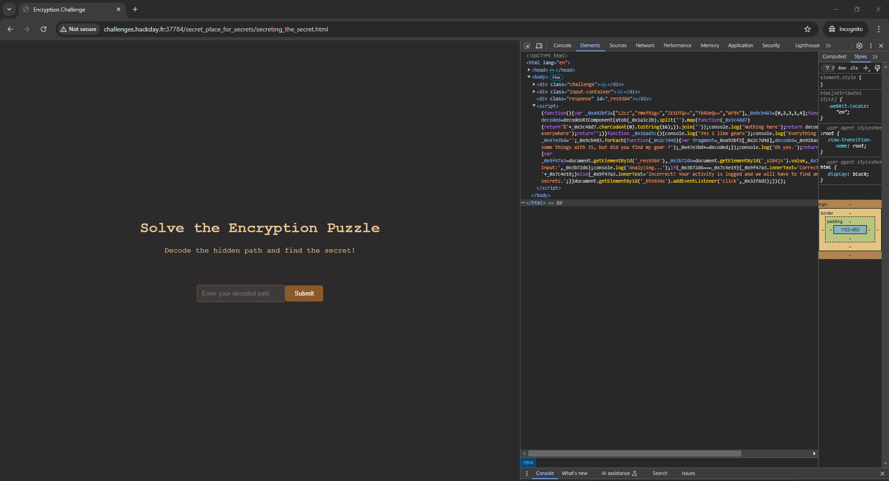
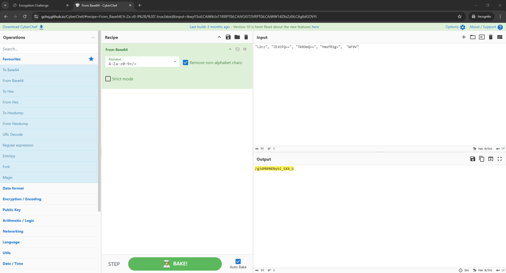
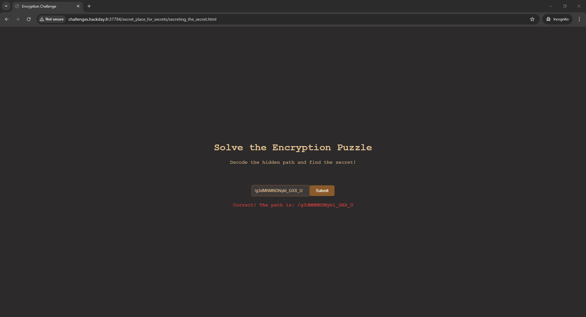
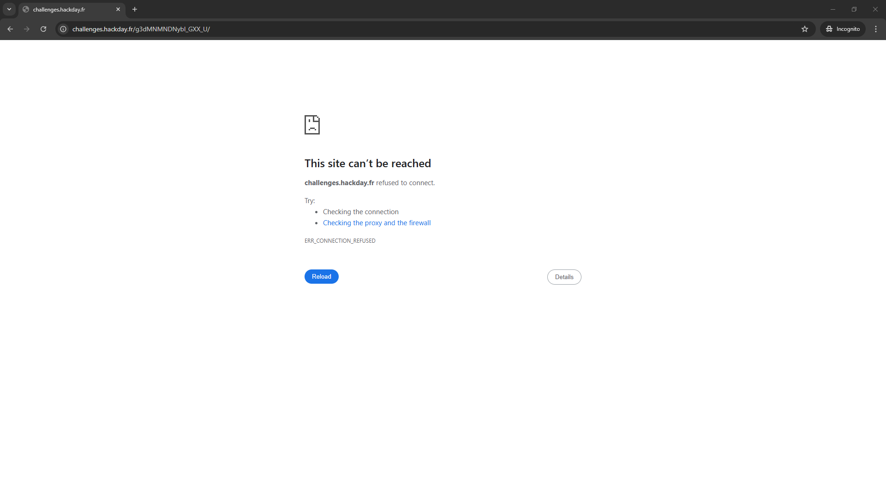

# The Watchful Gears: Uncover the Secrets Within

> This website clearly hides a lot of things... be careful, it seems the administrator of this website is monitoring activity! Proceed slowly but surely...
> 
> Fuzzing is prohibited on this challenge, same as automatic tools like dirbuster. There's no need of enumeration on this challenge, all have to be done manually. Automatic tools usage can be punished.
> 
> `challenges.hackday.fr:37784`

Upon opening the URL, we see the next webpage.



We see no input elements. So let's investigate the sources. Press `F12` to open dev tools and navigate to `Sources`. We see that the image was taken from `secret_place_for_secrets` folder.



After opening `http://challenges.hackday.fr:37784/secret_place_for_secrets/`, we could see the `secreting_the_secret.html` file here.



The newly opened webpage contains an input field and a `<script>`  element, which should help us determine the right secret path.



The formatted code of the script tells us what is the logic behind the right answer. Upon investigating, we can see that the code takes encoded values from `_0xa92bf2` in `_0x9cb483` order. Then it decodes them and checks them against the user's input.

```js
(function () {
  var _0xa92bf2 = ["L2cz", "YmxfR1g=", "ZE1OTQ==", "TkROeQ==", "WF9V"],
    _0x9cb483 = [0, 2, 3, 1, 4];
  function _0x928acd(_0x1a3c2b) {
    try {
      var decoded = decodeURIComponent(
        atob(_0x1a3c2b)
          .split("")
          .map(function (_0x3c48d7) {
            return "%" + _0x3c48d7.charCodeAt(0).toString(16);
          })
          .join("")
      );
      console.log("Nothing here");
      return decoded;
    } catch (e) {
      console.error("Gears, everywhere");
      return "";
    }
  }
  function _0x18ad3c() {
    console.log("Yes I like gears");
    console.log("Everything fine with my gears ?");
    var _0x47e3bd = "";
    _0x9cb483.forEach(function (_0x2c7d48) {
      var fragment = _0xa92bf2[_0x2c7d48],
        decoded = _0x928acd(fragment);
      console.log("Doing some things with JS, but did you find my gear ?");
      _0x47e3bd += decoded;
    });
    console.log("Oh yes.");
    return _0x47e3bd;
  }
  function _0x32f8d2() {
    var _0x9f47a3 = document.getElementById("_res9384"),
      _0x3b72d6 = document.getElementById("_x284js").value,
      _0x7c4e19 = _0x18ad3c();
    console.log("User Input:", _0x3b72d6);
    console.log("Analyzing...");
    if (_0x3b72d6 === _0x7c4e19) {
      _0x9f47a3.innerText = "Correct! The path is: " + _0x7c4e19;
    } else {
      _0x9f47a3.innerText =
        "Incorrect! Your activity is logged and we will have to find and kill you for trying to find our secrets.";
    }
  }
  document.getElementById("_btn934s").addEventListener("click", _0x32f8d2);
})();
```
After arranging the values in the correct order `"L2cz", "ZE1OTQ==", "TkROeQ==", "YmxfR1g=",  "WF9V"`, we will use [CyberChef](https://gchq.github.io/CyberChef/#recipe=From_Base64('A-Za-z0-9%2B/%3D',true,false)&input=IkwyY3oiLCAiWkUxT1RRPT0iLCAiVGtST2VRPT0iLCAiWW14ZlIxZz0iLCAgIldGOVYi) with Base64 recipe to decrypt the correct answer `/g3dMNMNDNybl_GXX_U`.



Verifying this on the task's website confirms that we are correct.



Opening URL `http://challenges.hackday.fr:37784/g3dMNMNDNybl_GXX_U` in browser will give us "This site can't be reached" error. Website will open `http://challenges.hackday.fr/g3dMNMNDNybl_GXX_U` instead of `http://challenges.hackday.fr:37784/g3dMNMNDNybl_GXX_U`.



Instead, we will try to use `curl -X GET http://challenges.hackday.fr:37784/g3dMNMNDNybl_GXX_U/` in console to get the right response.

This will provide us with the next response containing the flag.

```html
<!DOCTYPE html>
<html lang="en">
<head>
    <meta charset="UTF-8">
    <meta name="viewport" content="width=device-width, initial-scale=1.0">
    <title>The Order of Gears</title>
    <style>
        body {
            margin: 0;
            padding: 0;
            background-color: #2c2a2a;
            font-family: 'Courier New', Courier, monospace;
            color: #e0c097;
        }

        header {
            text-align: center;
            padding: 20px;
            background: linear-gradient(to right, #8b5a2b, #6d4c41);
            color: #fff;
            font-size: 2rem;
            font-weight: bold;
        }

        .content {
            padding: 20px;
            text-align: center;
        }

        .content h2 {
            margin-top: 30px;
        }

        .construction {
            margin: 30px auto;
            width: 300px;
            height: 300px;
            border: 10px solid #8b5a2b;
            border-radius: 50%;
            position: relative;
            animation: spin 10s linear infinite;
        }

        .construction img {
            position: absolute;
            top: 50%;
            left: 50%;
            transform: translate(-50%, -50%);
            width: 240px;
            height: 240px;
            border-radius: 50%;
        }

        .hidden-text {
            margin-top: 20px;
            color: #e0c097;
            visibility: hidden;
            opacity: 0;
            transition: visibility 0s, opacity 0.5s ease-in-out;
        }

        .hidden-text:hover {
            visibility: visible;
            opacity: 1;
        }

        footer {
            margin-top: 20px;
            text-align: center;
            font-size: 0.9rem;
            color: #b2a28e;
        }

        @keyframes spin {
            from {
                transform: rotate(0deg);
            }
            to {
                transform: rotate(360deg);
            }
        }
    </style>
</head>
<body>
    <h2>HACKDAY{ec4975e152bef92b2105681fd80f0c0e}</h2>
    
    <footer>
        <p>&copy; 2025 - The Order of Gears | All rights reserved.</p>
    </footer>
</body>
</html>
```

```HACKDAY{ec4975e152bef92b2105681fd80f0c0e}```
