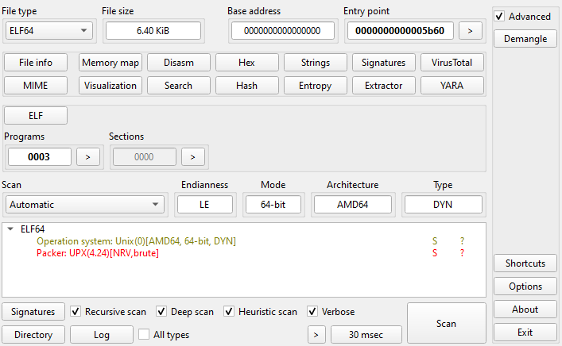
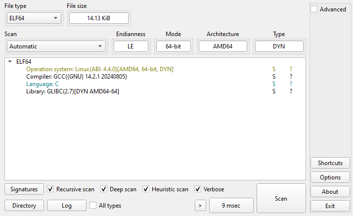
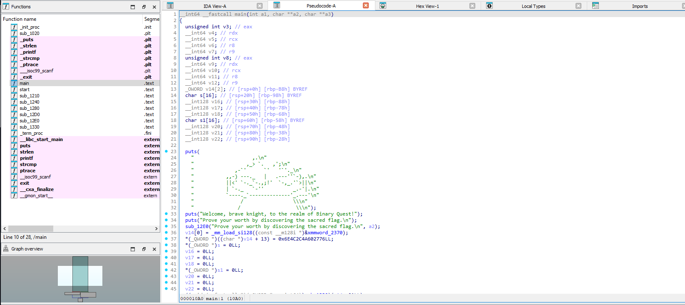
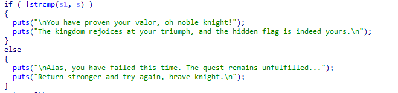
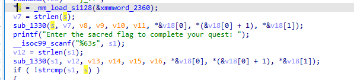
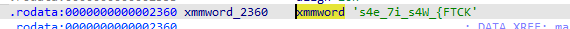
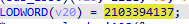
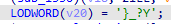

# Binary Quest

> In the far-off kingdom of Valoria, an ancient relic called the “Sacred Flag” lies hidden within a guarded fortress. Legend says only a true knight of cunning and skill can lay claim to its power. Dare you venture into the shadows and emerge victorious? Your journey begins now—onward, brave soul, and seize your destiny in the Binary Quest.

There's given `binary.quest` file.

Let's explore this binary. Firstly, let's use `Detect It Easy`, `PEiD` or any other tool to determine what kind of file it is:


Here, we see that the binary file is packed with `UPX`. Let's unpack the file:

```bash
upx -d binary.quest
```

Okay. Now, we see an ordinary binary file in `C`:



Then we can open it with `IDA`, `Ghidra` or any other decompiler:



`strcmp` is the most important part to get the flag:



Let's trace back. We can see that `s` gets the value from `xmmword_2360` variable:



Its value is reversed and it's `KCTF{_W4s_i7_e4s`



The rest part is reversed too and it's `Y?_}`:





The whole string is `KCTF{_W4s_i7_e4sY?_}`
