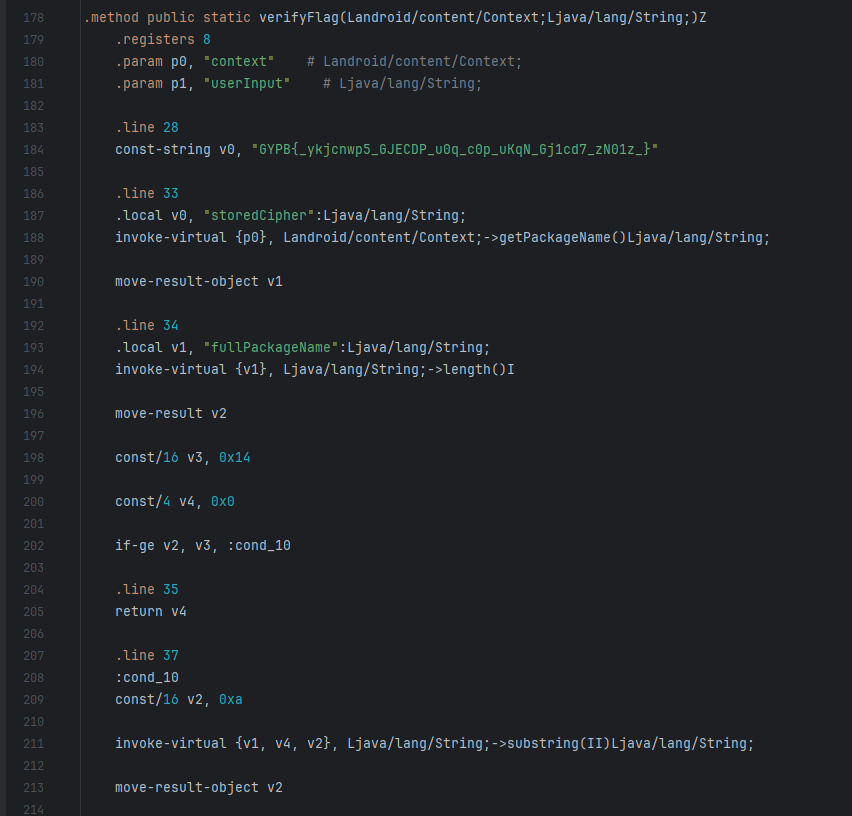

# Knight's Droid

Description:

> For ages, a cryptic mechanical guardian has slumbered beneath the Knight’s Citadel. Some say it holds powerful secrets once wielded by ancient code-wielding Knights. Many have tried to reactivate the droid and claim its hidden knowledge—yet none have returned victorious. Will you be the one to solve its riddles and awaken this legendary machine?

Here, we have a some APK file. Let's open it with `Android Studio` (you can use other tools for .apk files):

Let's take a look at `com.knightctf` folder:

`SecretKeyVerifier` looks very strange and maybe it contains a logic to get the flag:

So, it has several important strings. They can be parts of the flag:

Now, we can try to make a whole string or deepen into the logic and look what is going on down there:

We have a whole string. Let's try to determine what kind of encryption it is using awesome website [dcode.fr](https://www.dcode.fr/cipher-identifier):

Let's try `ROT Cipher` decrypting:

Oh, we got it: `KCTF{_congrat5_KNIGHT_y0u_g0t_yOuR_Kn1gh7_dR01d_}`
